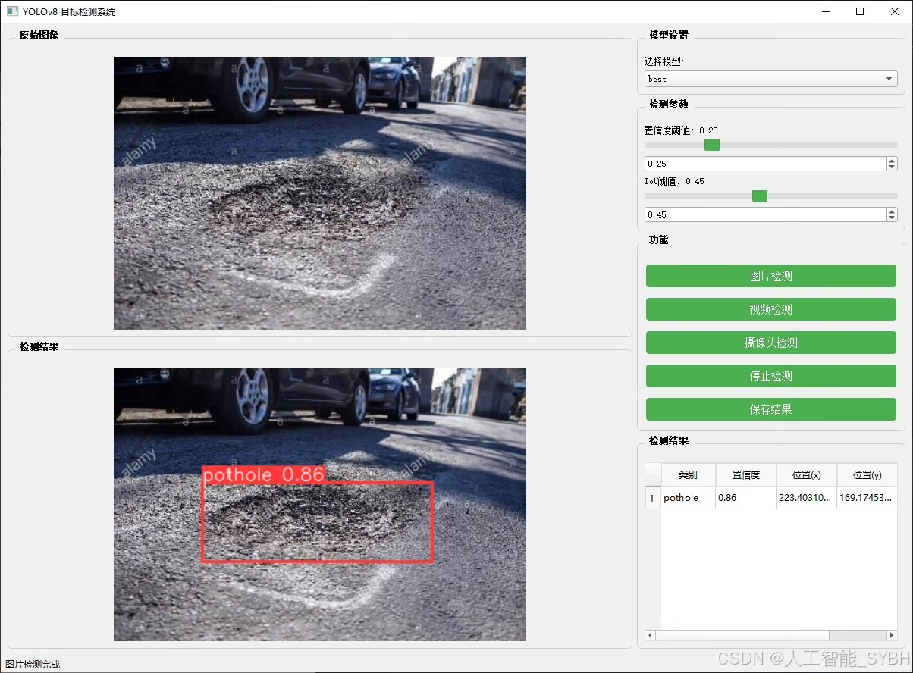
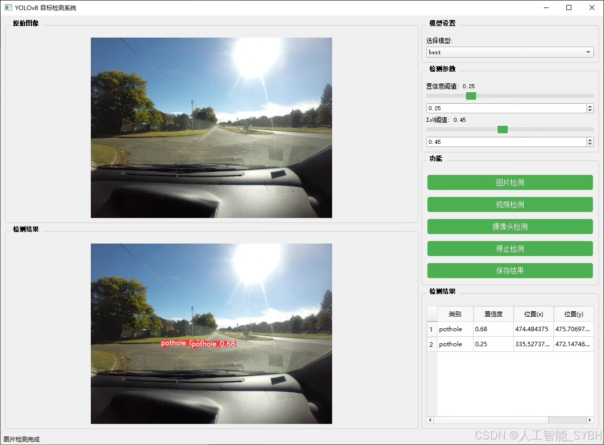
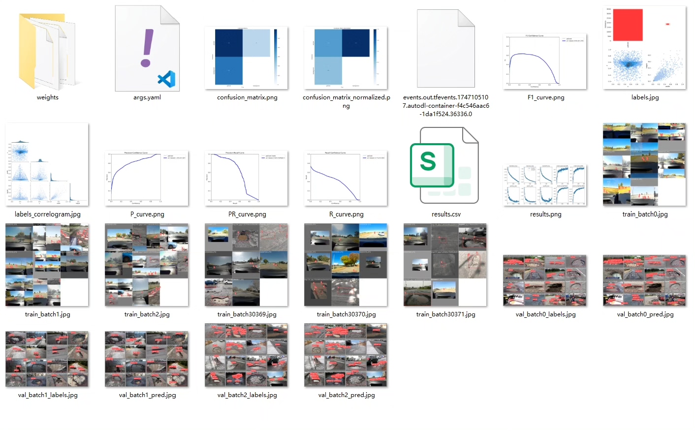
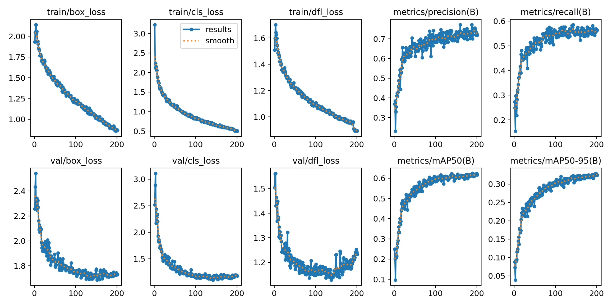
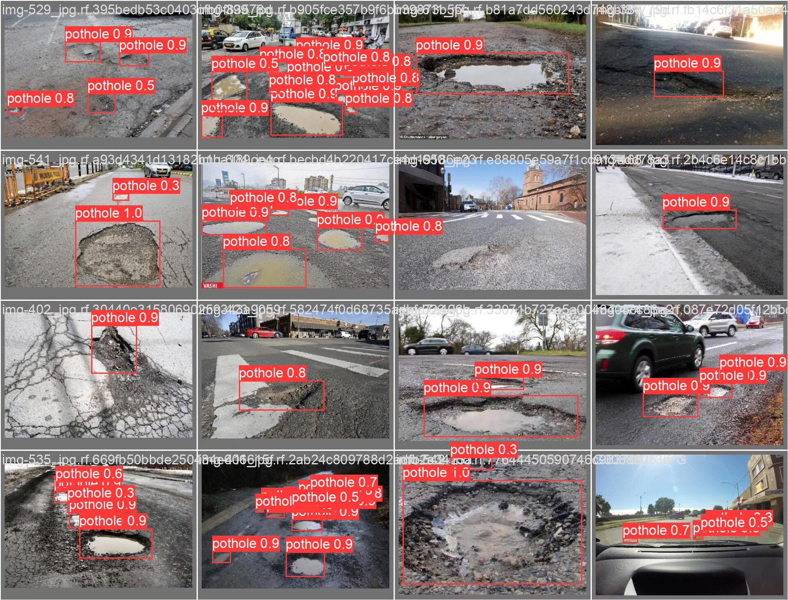
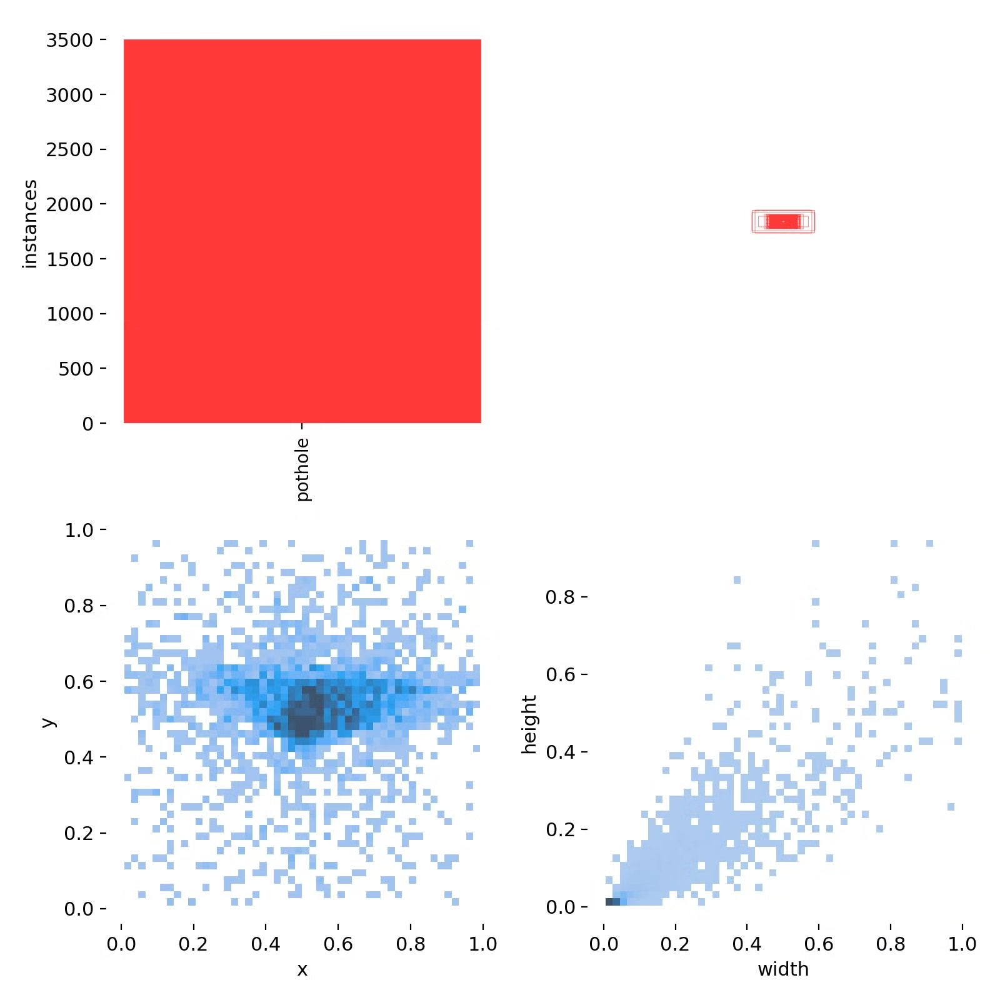
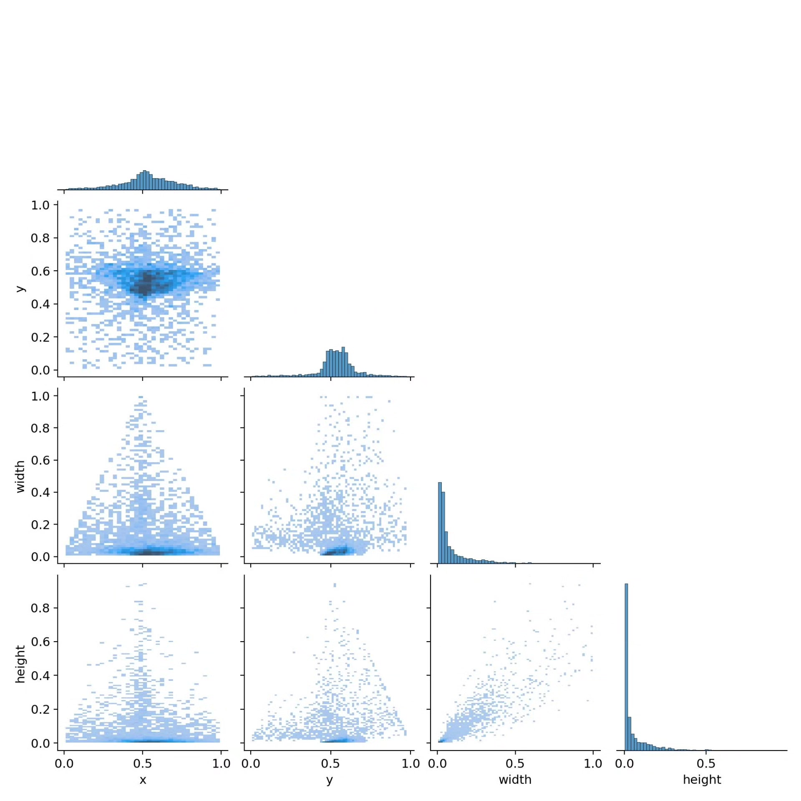
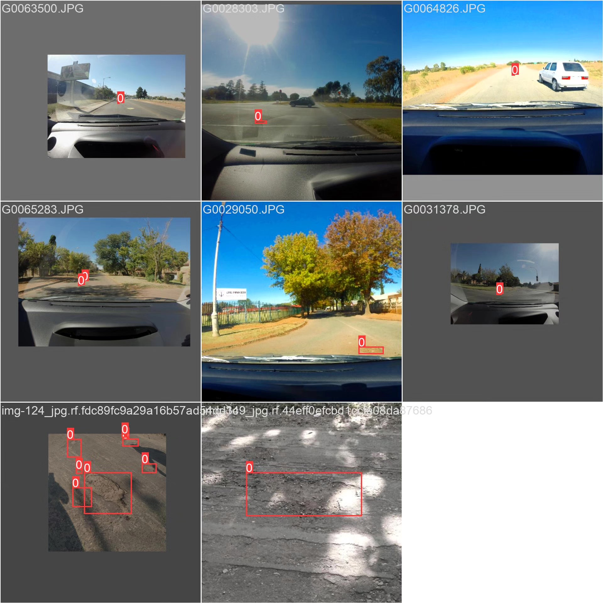

# Based on deep learning YOLOv8 road pothole detection system (YOLOv8+Y)

## Body

This project is based on the advanced YOLOv8 object detection algorithm, developing a highly efficient and accurate road pothole detection system. The system specifically targets the detection of road potholes (pothole) as a single category, using a dataset containing 1784 images (1265 training images, 401 validation images, and 118 test images). The system can identify pothole defects on the road surface in real-time, providing intelligent solutions for road maintenance and management. Through the application of deep learning technology, this system achieves practical levels in terms of detection accuracy and speed, significantly surpassing traditional manual inspection methods. The project has implemented full-process development from data collection, annotation, model training to actual application, providing powerful tools for intelligent traffic infrastructure management.

The company's products have obtained YOLO official commercial license certification.

We provide after-sales service.

After payment, we will provide WeChat ID for any questions.

Environment configuration: We will provide an environment configuration tutorial, and WeChat will provide answers.

Remote installation service: If you need remote configuration, an additional fee of 69 is required.
If the configuration fails, all fees will be refunded (only the installation fee is refundable for older computers).

Retraining dataset: After setting up the environment, you can train on your own computer.
If you need us to retrain, just pay 69 + computing power fees (2.5 yuan/hour).

Full after-sales service

## Images

## Payment

Here is a pay link on Stripe ( https://buy.stripe.com/3cs8yP7sY87d0vu9AB ). Please contact me lonlonago@foxmail.com after funding $89, and I will send you a complete data files , thank you!

